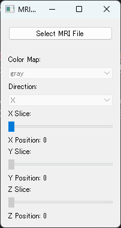
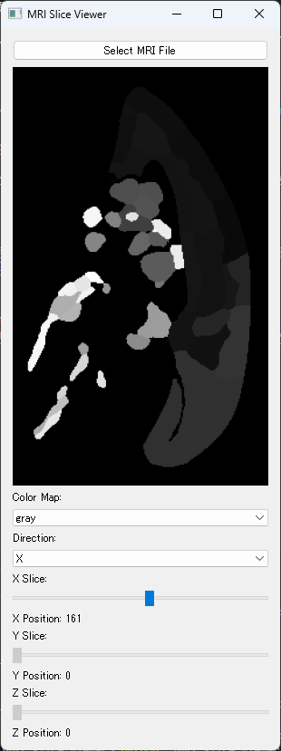
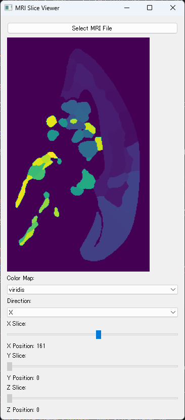

# MRI_slice_viewer

大学院の講義の自由課題で作成したもの.

対応する.giiファイルを読み込むと, 3D脳データを2Dで表示することができる. また, 2Dで表示した際に, xyzのスライドを動かすことで, 3D脳データのスライスを動かすことができる.

## 使い方

コマンドラインで `python MRI_slice_viewer.py` と入力すると, GUIが立ち上がる. あとは, GUIの指示に従って操作する.

Select MRI File ボタンを押すと, MRIファイルを選択することができる. MRIファイルは, .giiファイルである必要がある.

MRIファイルを選択すると, MRIのスライス画像が表示される. スライスの位置は, xyzのスライダーを動かすことで変更することができる.

Color map は変えることができる.

データ例の元: [https://dataportal.brainminds.jp/atlas-package-download-main-page/bma-2019-ex-vivo](https://dataportal.brainminds.jp/atlas-package-download-main-page/bma-2019-ex-vivo)

データ元論文:
Woodward, Alexander; Gong, Rui; Nakae, Ken; Hata, Junichi; Okano, Hideyuki; Ishii, Shin; Yamaguchi, Yoko : Brain/MINDS 3D Marmoset Reference Brain Atlas 2019 (DataID: 4520) [https://doi.org/10.24475/bma.4520](https://doi.org/10.24475/bma.4520)
